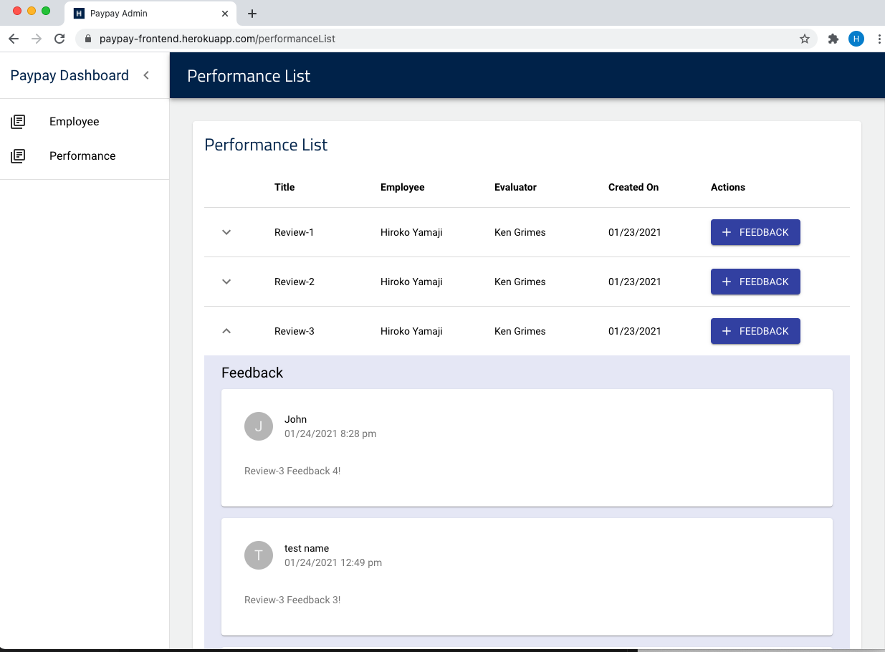

# Paypay Full Stack Developer Challenge

### Production URL

- Front-End: https://paypay-frontend.herokuapp.com/
- Back-End: https://paypay-backend.herokuapp.com/

### Technologies

- Web Framework: React
- Front-End Packages: Redux, Redux-Form, Material-UI, Moment.js, Lodash, Apollo Client
- Database: MongoDB
- Cloud Server: Heroku
- Backend API: [GraphQL Apollo Server](https://www.apollographql.com/docs/apollo-server/)

### Repositories

- Front-End: https://github.com/hirokoymj/Paypay-frontend
- Back-End: https://github.com/hirokoymj/Paypay-backend

### How to start app in your local

```js
yarn  // Install necessary packages
yarn dev // Start app
```

### Screenshot


